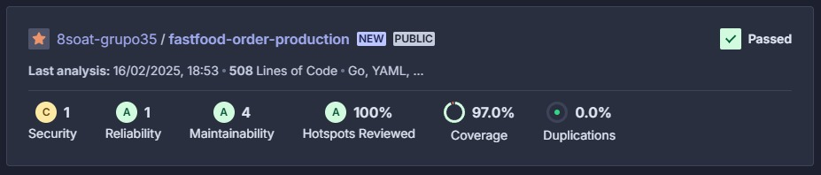

# Fastfood Order Production - GRUPO 35

## Conteúdo

- [Sobre](#sobre)
- [Cobertura de testes](#cobertura-de-testes)
- [Contribuidores](#contribuidores)

## Sobre

Microserviço de Order Production responsável pela produção dos pedidos, utilizando serviços da AWS como Dynamo DB, EC2.

## Cobertura de testes




## Como rodar a aplicação localmente

Para rodar a aplicação, deve-se executar o comando:

```
docker-compose up
```

Para visualizar o **Swagger**, devemos manter a aplicação rodando e acessar a URL abaixo:

`http://localhost:8000/swagger/index.html`

<!-- 
# Rodar os testes

1. Instalação do gomock para execução dos testes localmente

```
go install go.uber.org/mock/mockgen@latest
```

2. Geração dos arquivos de mock preenchidos via go generate no projeto

```
go generate ./...
```

3. Execução dos testes do projeto

```
go test ./test/...
``` -->

## Contribuidores

- Egio Lima
- Gabriel Rosa Nunes
- Irlan Gomes
- Jhony Eduardo Senem